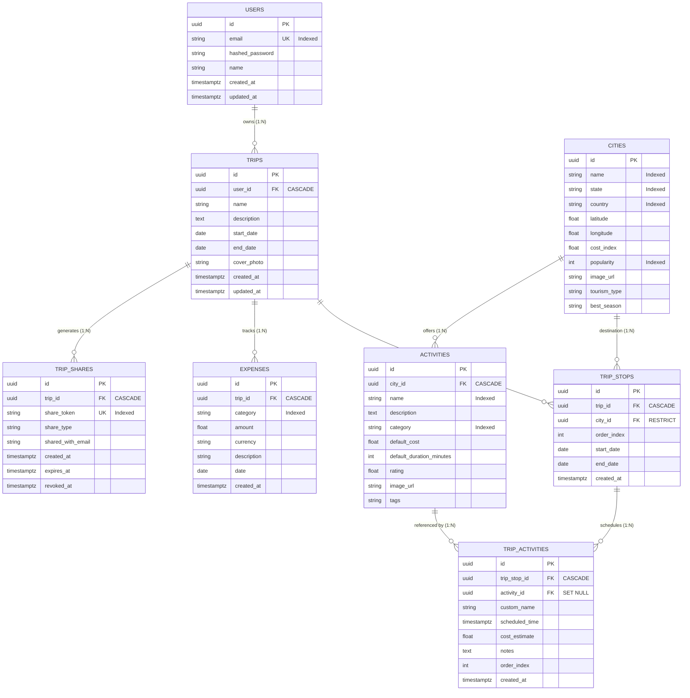

# GlobeTrotter Database Data Model Specification

## 1. Overview
This document defines the relational database architecture for GlobeTrotter, designed around the official Problem Statement for multi-city travel planning, budgeting, discovery, and read-only itinerary sharing.

- **RDBMS**: PostgreSQL
- **ORM**: SQLAlchemy 2.x
- **Migrations**: Alembic
- **Primary Keys**: UUID (v4) across all entities

---

## 2. Entity-Relationship (ER) Diagram



---

## 3. Entity Specifications

### 3.1 `users`
Represents registered platform travelers.

| Column | Type | Constraints | Description |
| :--- | :--- | :--- | :--- |
| `id` | `UUID` | `PRIMARY KEY`, Default: `uuid.uuid4` | Unique User identifier |
| `email` | `VARCHAR(255)` | `UNIQUE`, `NOT NULL`, `INDEX` | Login email address |
| `hashed_password` | `VARCHAR(255)` | `NOT NULL` | Bcrypt password hash |
| `name` | `VARCHAR(100)` | `NOT NULL` | Full display name |
| `created_at` | `TIMESTAMPTZ` | `NOT NULL`, `DEFAULT now()` | Account creation time |
| `updated_at` | `TIMESTAMPTZ` | `DEFAULT now()`, `ON UPDATE now()` | Last update timestamp |

* **Relationships**:
  * `trips`: One-to-Many with `Trip` (`cascade="all, delete-orphan"`, `passive_deletes=True`).

---

### 3.2 `cities`
Global destination catalog supporting multi-city search, geocoding, and tier ratings.

| Column | Type | Constraints | Description |
| :--- | :--- | :--- | :--- |
| `id` | `UUID` | `PRIMARY KEY`, Default: `uuid.uuid4` | Unique City identifier |
| `name` | `VARCHAR(100)` | `NOT NULL`, `INDEX` | City name (e.g. "Jaipur", "Goa") |
| `state` | `VARCHAR(100)` | `NULLABLE`, `INDEX` | State or province (e.g. "Rajasthan") |
| `country` | `VARCHAR(100)` | `NOT NULL`, `INDEX`, `DEFAULT 'India'` | Country name |
| `latitude` | `FLOAT` | `NULLABLE` | GPS Latitude for maps |
| `longitude` | `FLOAT` | `NULLABLE` | GPS Longitude for maps |
| `cost_index` | `FLOAT` | `NULLABLE`, `DEFAULT 1.0` | Cost multiplier index (Tier 1: 1.8, Tier 2: 1.3, Tier 3: 0.9) |
| `popularity` | `INTEGER` | `NULLABLE`, `INDEX`, `DEFAULT 0` | Popularity score (0 - 100) for sorting |
| `image_url` | `VARCHAR(500)` | `NULLABLE` | Curated cover photo image URL |
| `tourism_type` | `VARCHAR(255)` | `NULLABLE` | Tourism tags (e.g. "heritage culture palace") |
| `best_season` | `VARCHAR(50)` | `NULLABLE` | Ideal season (e.g. "winter", "summer", "all") |

* **Relationships**:
  * `activities`: One-to-Many with `Activity` (`cascade="all, delete-orphan"`).
  * `trip_stops`: One-to-Many with `TripStop`.

---

### 3.3 `activities`
Master catalog of things to do, sightseeing spots, and attractions in each city.

| Column | Type | Constraints | Description |
| :--- | :--- | :--- | :--- |
| `id` | `UUID` | `PRIMARY KEY`, Default: `uuid.uuid4` | Unique Activity identifier |
| `city_id` | `UUID` | `FOREIGN KEY(cities.id) ON DELETE CASCADE`, `NOT NULL`, `INDEX` | Parent city |
| `name` | `VARCHAR(200)` | `NOT NULL`, `INDEX` | Activity name (e.g. "Amber Fort Guided Tour") |
| `description` | `TEXT` | `NULLABLE` | Activity description |
| `category` | `VARCHAR(50)` | `NULLABLE`, `INDEX` | Category: `sightseeing`, `culture`, `adventure`, `food`, `shopping`, `wellness` |
| `default_cost` | `FLOAT` | `NOT NULL`, `DEFAULT 0.0` | Default estimated cost |
| `default_duration_minutes` | `INTEGER` | `NOT NULL`, `DEFAULT 60` | Duration in minutes |
| `rating` | `FLOAT` | `NULLABLE` | Average rating score (e.g. 4.8) |
| `image_url` | `VARCHAR(500)` | `NULLABLE` | Photo URL |
| `tags` | `VARCHAR(255)` | `NULLABLE` | Search tags |

* **Relationships**:
  * `city`: Many-to-One with `City`.
  * `trip_activities`: One-to-Many with `TripActivity`.

---

### 3.4 `trips`
Top-level trip itinerary entity owned by a user.

| Column | Type | Constraints | Description |
| :--- | :--- | :--- | :--- |
| `id` | `UUID` | `PRIMARY KEY`, Default: `uuid.uuid4` | Unique Trip identifier |
| `user_id` | `UUID` | `FOREIGN KEY(users.id) ON DELETE CASCADE`, `NOT NULL`, `INDEX` | Trip creator |
| `name` | `VARCHAR(200)` | `NOT NULL` | Trip title (e.g. "Royal Golden Triangle") |
| `description` | `TEXT` | `NULLABLE` | Itinerary notes or overview |
| `start_date` | `DATE` | `NULLABLE` | Overall trip start date |
| `end_date` | `DATE` | `NULLABLE` | Overall trip end date |
| `cover_photo` | `VARCHAR(500)` | `NULLABLE` | Cover banner photo URL |
| `created_at` | `TIMESTAMPTZ` | `NOT NULL`, `DEFAULT now()` | Creation timestamp |
| `updated_at` | `TIMESTAMPTZ` | `DEFAULT now()`, `ON UPDATE now()` | Last update timestamp |

* **Relationships**:
  * `user`: Many-to-One with `User`.
  * `stops`: One-to-Many with `TripStop` (`cascade="all, delete-orphan"`, `order_by="TripStop.order_index"`).
  * `expenses`: One-to-Many with `Expense` (`cascade="all, delete-orphan"`).
  * `shares`: One-to-Many with `TripShare` (`cascade="all, delete-orphan"`).

---

### 3.5 `trip_stops`
Represents an ordered destination stop within a multi-city itinerary.

| Column | Type | Constraints | Description |
| :--- | :--- | :--- | :--- |
| `id` | `UUID` | `PRIMARY KEY`, Default: `uuid.uuid4` | Unique Stop identifier |
| `trip_id` | `UUID` | `FOREIGN KEY(trips.id) ON DELETE CASCADE`, `NOT NULL`, `INDEX` | Parent trip |
| `city_id` | `UUID` | `FOREIGN KEY(cities.id) ON DELETE RESTRICT`, `NOT NULL`, `INDEX` | Target city |
| `order_index` | `INTEGER` | `NOT NULL`, `DEFAULT 0` | Stop sequence order (1, 2, 3...) |
| `start_date` | `DATE` | `NULLABLE` | Arrival date at this stop |
| `end_date` | `DATE` | `NULLABLE` | Departure date from this stop |
| `created_at` | `TIMESTAMPTZ` | `NOT NULL`, `DEFAULT now()` | Creation timestamp |

* **Composite Indexes**:
  * `idx_trip_stops_trip_order`: Index on `(trip_id, order_index)` for fast itinerary ordering.
* **Relationships**:
  * `trip`: Many-to-One with `Trip`.
  * `city`: Many-to-One with `City`.
  * `activities`: One-to-Many with `TripActivity` (`cascade="all, delete-orphan"`, `order_by="TripActivity.order_index"`).

---

### 3.6 `trip_activities`
Represents a scheduled activity or custom event within a specific trip stop.

| Column | Type | Constraints | Description |
| :--- | :--- | :--- | :--- |
| `id` | `UUID` | `PRIMARY KEY`, Default: `uuid.uuid4` | Unique TripActivity identifier |
| `trip_stop_id` | `UUID` | `FOREIGN KEY(trip_stops.id) ON DELETE CASCADE`, `NOT NULL`, `INDEX` | Parent trip stop |
| `activity_id` | `UUID` | `FOREIGN KEY(activities.id) ON DELETE SET NULL`, `NULLABLE`, `INDEX` | Linked catalog activity (null if custom) |
| `custom_name` | `VARCHAR(200)` | `NULLABLE` | Custom event name |
| `scheduled_time` | `TIMESTAMPTZ` | `NULLABLE` | Date & time for timeline visualization |
| `cost_estimate` | `FLOAT` | `NOT NULL`, `DEFAULT 0.0` | Cost estimate for budget calculation |
| `notes` | `TEXT` | `NULLABLE` | Booking reference, voucher notes |
| `order_index` | `INTEGER` | `NOT NULL`, `DEFAULT 0` | Daily order sequence |
| `created_at` | `TIMESTAMPTZ` | `NOT NULL`, `DEFAULT now()` | Creation timestamp |

* **Composite Indexes**:
  * `idx_trip_activities_stop_order`: Index on `(trip_stop_id, order_index)` for timeline rendering.

---

### 3.7 `expenses`
Records itemized trip expenses for category breakdown and total cost computation.

| Column | Type | Constraints | Description |
| :--- | :--- | :--- | :--- |
| `id` | `UUID` | `PRIMARY KEY`, Default: `uuid.uuid4` | Unique Expense identifier |
| `trip_id` | `UUID` | `FOREIGN KEY(trips.id) ON DELETE CASCADE`, `NOT NULL`, `INDEX` | Parent trip |
| `category` | `VARCHAR(50)` | `NOT NULL`, `INDEX` | Category: `transport`, `stay`, `activities`, `meals`, `shopping`, `other` |
| `amount` | `FLOAT` | `NOT NULL` | Expense amount |
| `currency` | `VARCHAR(10)` | `NOT NULL`, `DEFAULT 'USD'` / `'INR'` | Currency code |
| `description` | `VARCHAR(255)` | `NULLABLE` | Item description (e.g. "Flight Delhi -> Jaipur") |
| `date` | `DATE` | `NULLABLE` | Incurred date |
| `created_at` | `TIMESTAMPTZ` | `NOT NULL`, `DEFAULT now()` | Creation timestamp |

* **Composite Indexes**:
  * `idx_expenses_trip_category`: Index on `(trip_id, category)` for fast aggregation queries.

---

### 3.8 `trip_shares`
Manages public read-only URLs and future friend-specific itinerary access.

| Column | Type | Constraints | Description |
| :--- | :--- | :--- | :--- |
| `id` | `UUID` | `PRIMARY KEY`, Default: `uuid.uuid4` | Unique Share identifier |
| `trip_id` | `UUID` | `FOREIGN KEY(trips.id) ON DELETE CASCADE`, `NOT NULL`, `INDEX` | Shared trip |
| `share_token` | `VARCHAR(64)` | `UNIQUE`, `NOT NULL`, `INDEX` | Public secure random token (e.g. `golden-triangle-india-demo`) |
| `share_type` | `VARCHAR(20)` | `NOT NULL`, `DEFAULT 'public'` | Share type (`public` or `friend`) |
| `shared_with_email` | `VARCHAR(255)` | `NULLABLE` | Email for targeted friend sharing |
| `created_at` | `TIMESTAMPTZ` | `NOT NULL`, `DEFAULT now()` | Share generation time |
| `expires_at` | `TIMESTAMPTZ` | `NULLABLE` | Optional expiration date |
| `revoked_at` | `TIMESTAMPTZ` | `NULLABLE` | Revocation timestamp if access is disabled |

---

## 4. Budget & Category Calculation Model

The backend calculates budget metrics dynamically from relational data:

1. **Total Trip Cost**:
   $$\text{Total Cost} = \sum_{\text{Expense}} \text{amount}$$
2. **Category Breakdown**:
   Group `Expense` by `category` and compute sum per bucket (`transport`, `stay`, `activities`, `meals`, `shopping`, `other`).
3. **Daily Average**:
   $$\text{Daily Average} = \frac{\text{Total Cost}}{\max(1, (\text{end\_date} - \text{start\_date}).\text{days})}$$

---

## 5. Sharing Model
- **Public Itinerary Sharing**: Generates a unique `share_token` in `TripShare`.
- **Read-Only Access**: Unauthenticated visitors query `GET /api/public/trips/{share_token}` which joins `TripShare` $\rightarrow$ `Trip` $\rightarrow$ `TripStop` $\rightarrow$ `TripActivity` without exposing passwords or write privileges.
- **Revocation**: Setting `revoked_at` disables link access without deleting the trip.

---

## 6. Migration & Seeding Commands

### Run Alembic Migrations
```bash
# From repository root:
alembic -c backend/alembic.ini upgrade head

# Or from backend/ directory:
cd backend
alembic upgrade head
```

### Seed Dataset
```bash
# Seed 55+ Indian cities, 400+ activities/places, demo user & sample itinerary:
$env:PYTHONPATH="backend"
python -m app.db.seed
```
